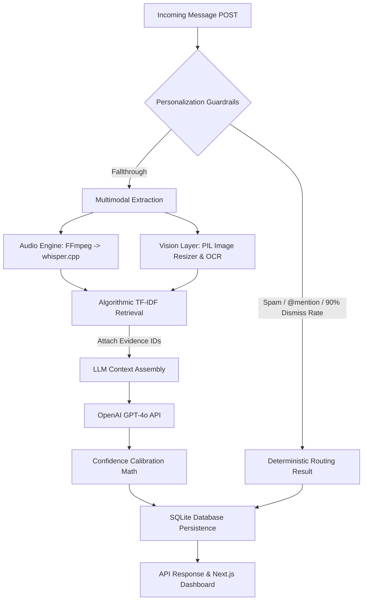

# WhatsApp Message Notification Router

An intelligent, multi-stage, cost-optimized backend routing engine and evaluation dashboard for WhatsApp messages. Built for **HackerRank Orchestrate**.

The system ingests multimodal messages (text, image posters/screenshots, voice notes) and routes them into one of three categories:
- `notify`: Urgent/interrupting messages that require immediate attention.
- `digest`: Safe, non-urgent messages batched for later review.
- `mute`: Spam, scams, low-value, repetitive, or unsafe content.

---

## Architecture & System Flow



### Why a Hybrid Architecture?

A purely LLM-based router looks good in a prompt but degrades in production due to hallucinated evidence, flat confidence scores, and a tendency to ignore statistical realities (like a user dismissing 90% of notifications from a specific group).

This architecture splits responsibilities strategically:
- **Deterministic Personalization Guardrails:** Messages from senders with extreme historical skip/report rates are intercepted *before* the LLM. Scam heuristics and direct `@mentions` are also hardcoded. This guarantees user personalization safety.
- **Algorithmic Evidence Retrieval:** Instead of asking an LLM to hallucinate historical message IDs, a Python-native Jaccard token similarity algorithm retrieves the mathematically correct supporting evidence IDs from the user's history database.
- **Mathematical Confidence Calibration:** Flat LLM confidence outputs are mathematically bound by the density of the user's history and the presence of matching evidence.
- **Nuanced LLM Reasoning:** Saved strictly for ambiguous grey-area messages (e.g. is this promotion useful?) and explicit Multimodal OCR analysis.

### Key Components

1. **Deterministic Fast Path:** Bypasses LLM inference for obvious spam, scam patterns (OTP/verification requests), direct `@mentions`, empty messages, and unverified business domain mismatches.
2. **Local C++ Audio Engine:** Wraps `whisper.cpp` via an FFmpeg pipeline to transcribe voice notes locally with sub-second latency and zero API cost.
3. **Cloud Vision & LLM Routing (Deep Path):** Leverages `gpt-4o` with structured Pydantic JSON enforcement and strict Chain-of-Thought (CoT) prompting to reason over user preferences, DND windows, historical engagement, groups, and business metadata. Built-in exponential backoff and jitter algorithms ensure robust handling of OpenAI TPM rate limits during high-volume batch evaluations.
4. **Evaluation Engine & Dashboard:** A Next.js 15 app router web interface visualizing real-time routing decisions, message logs, audio transcripts, LLM reasoning, and benchmark metrics (Accuracy, Precision, Recall, Macro-F1, Notify FPR).

---

## Repository Layout

```text
.
├── backend/
│   ├── app/
│   │   ├── api/
│   │   │   └── routes/          # FastAPI endpoints (route-message, logs, batch-eval)
│   │   ├── core/                # Configuration (Pydantic BaseSettings) & security (API token validation)
│   │   ├── db/                  # SQLAlchemy 2.0 database engine (concurrent write-optimized) & models
│   │   ├── schemas/             # Pydantic v2 request/response schemas
│   │   └── services/            # Core logic (data_loader, audio_engine, vision_llm, router, metrics)
│   ├── main.py                  # FastAPI server entrypoint
│   └── requirements.txt         # Python dependencies
├── frontend/
│   ├── src/
│   │   ├── app/                 # Next.js 15 App Router pages (Overview, Logs, Eval)
│   │   ├── components/          # Reusable UI components (Sidebar, Sheet, Badges)
│   │   └── lib/                 # Axios API client & utils
│   └── package.json
├── scripts/
│   ├── build_whisper.sh         # Builds C++ whisper.cpp binary & downloads base model
│   └── run_eval.py              # Headless CLI batch evaluation script
├── Makefile                     # Shortcut commands for setup & execution
├── docker-compose.yml           # Containerized multi-service deployment
├── Prompt.md                    # Original challenge specification
├── .env.example                 # Environment template
└── README.md                    # You are here
```

---

## Prerequisites

- **Python:** 3.11 or higher
- **Node.js:** 18.x or higher
- **FFmpeg:** Required for audio format conversion (transcoding voice notes to 16kHz WAV)
- **Make & C++ Compiler:** Required for building `whisper.cpp` locally (optional; gracefully degrades if missing)

---

## Getting Started

### 1. Environment Setup

Clone the repository and copy the environment template:

```bash
cp .env.example backend/.env
```

Edit `backend/.env` to include your OpenAI API key:

```env
OPENAI_API_KEY=your_openai_api_key_here
API_BEARER_TOKEN=dev-token
DATABASE_URL=sqlite:///./messages.db
MEDIA_STORAGE_PATH=./dataset/media
DATASET_PATH=./dataset
USER_HANDLE=@Rafay
```

### 2. Backend Setup

```bash
make install-backend
```

Or manually:

```bash
cd backend
python3 -m venv venv
source venv/bin/activate
pip install -r requirements.txt
```

### 3. Build whisper.cpp (Optional)

To enable local voice note transcription:

```bash
make build-whisper
```

*Note: If `whisper.cpp` or `ffmpeg` is not present, the routing engine degrades gracefully by skipping audio transcription and routing based on text and context metadata.*

### 4. Frontend Setup

```bash
cd frontend
npm install
```

---

## Running the Application

### Start Backend

```bash
make start-backend
```
The FastAPI server will run on `http://localhost:8000`. Swagger API docs are accessible at `http://localhost:8000/docs`.

### Start Frontend Dashboard

```bash
make start-frontend
```
The Next.js dashboard will run on `http://localhost:3000`.

### Headless CLI Evaluation

To execute the batch evaluation pipeline on `dataset/messages.csv` and generate `output.csv`:

```bash
python scripts/run_eval.py --api-url http://localhost:8000 --force
```

---

## Output Contract (`output.csv`)

The evaluation pipeline produces `output.csv` matching the exact challenge submission format:

| Column | Description |
|---|---|
| `message_id` | Incoming message ID |
| `action` | Final routing decision: `notify`, `digest`, or `mute` |
| `message_type` | Category (`personal`, `urgent`, `event`, `payment`, `business_update`, `promotion`, `greeting`, `forward`, `spam`, `scam`, `unknown`) |
| `reason` | Step-by-step human-readable explanation |
| `confidence` | Confidence score from `0.0` to `1.0` |
| `evidence_message_ids` | Semicolon-separated historical message IDs used as evidence, or `none` |

---

## API Endpoints

- `POST /api/v1/route-message` — Route a single message and persist the result.
- `GET /api/v1/logs` — Fetch paginated message audit logs with optional filter by decision (`notify`, `digest`, `mute`).
- `GET /api/v1/dashboard-stats` — Fetch aggregate routing KPI statistics.
- `POST /api/v1/batch-eval` — Trigger full batch processing of `messages.csv` and compute evaluation metrics against golden labels.
- `GET /health` — System health check.

---

## Tech Stack

- **Backend:** Python 3.11, FastAPI, SQLAlchemy 2.0, Pydantic v2, OpenAI SDK (`gpt-4o-mini`), `whisper.cpp`, FFmpeg, Pandas, SQLite3.
- **Frontend:** Next.js 15 (App Router), React 19, TypeScript, Tailwind CSS v4, Recharts, Axios, Lucide Icons.

---

## License

MIT License
